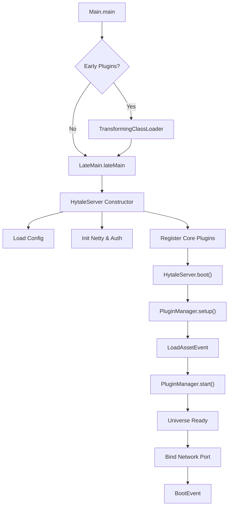

# Hytale Server Boot Sequence

The Hytale server boot process is a multi-stage sequence that initializes the Java environment, loads plugins, and prepares the game universe.

## 1. Entry Point: `Main.java`

The server application starts in `com.hypixel.hytale.Main.main(String[] args)`.

1.  **Environment Setup**:
    *   Sets `Locale.ENGLISH`.
    *   Sets `java.awt.headless` to `true`.
    *   Sets `file.encoding` to `UTF-8`.
2.  **Early Plugin Loading**:
    *   Calls `EarlyPluginLoader.loadEarlyPlugins(args)`.
    *   If transformers are present, it launches with a `TransformingClassLoader`.
3.  **Late Entry**:
    *   Calls `LateMain.lateMain(args)`.

## 2. Initialization: `LateMain.java`

`LateMain` serves as the bridge between the raw Java environment and the Hytale Server instance.

1.  **Option Parsing**: Parses command-line arguments using `Options.parse(args)`.
2.  **Logging**: Initializes `HytaleLogger` and `HytaleFileHandler`.
3.  **Server Instantiation**: Creates a new instance of `com.hypixel.hytale.server.core.HytaleServer`.

## 3. Core Server Setup: `HytaleServer.java`

The `HytaleServer` constructor performs the bulk of the initialization.

1.  **Singletons**: Sets `instance` to self.
2.  **Thread Keep-Alive**: Starts a keep-alive thread `ThreadUtil.createKeepAliveThread`.
3.  **Config**: Loads `HytaleServerConfig` from disk.
4.  **Auth**: Initializes `ServerAuthManager`.
5.  **Sentry**: Initializes Sentry for crash reporting (unless disabled).
6.  **Netty**: Calls `NettyUtil.init()` to prepare the networking stack.
7.  **Shutdown Hook**: Registers a shutdown hook.
8.  **Asset Registry**: Initializes `AssetRegistryLoader`.
9.  **Core Plugins**: Registers core plugins (including `Universe`) via `pluginManager.registerCorePlugin(manifest)`.
10. **Boot Trigger**: Calls `boot()`.

## 4. Boot Phase

The `boot()` method in `HytaleServer` executes the lifecycle steps:

1.  **Command Registration**: registers default commands.
2.  **Plugin Setup**: Calls `pluginManager.setup()`. This loads plugins from:
    *   `builtin` directory.
    *   Classpath.
    *   `mods` directory.
3.  **Asset Loading**: Dispatches `LoadAssetEvent`. If validation fails, the server shuts down.
4.  **Plugin Start**: Calls `pluginManager.start()`.
    *   Resolves dependencies.
    *   Calls `start0()` on all enabled plugins.
5.  **Universe Preparation**:
    *   Waits for `Universe.get().getUniverseReady()`.
    *   The `Universe` (a core plugin) loads worlds and configurations asynchronously.
6.  **Binding**: Calls `ServerManager.get().waitForBindComplete()` to ensure the network socket is open.
7.  **Completion**: Dispatches `BootEvent` and logs "Hytale Server Booted!".

## Diagram

