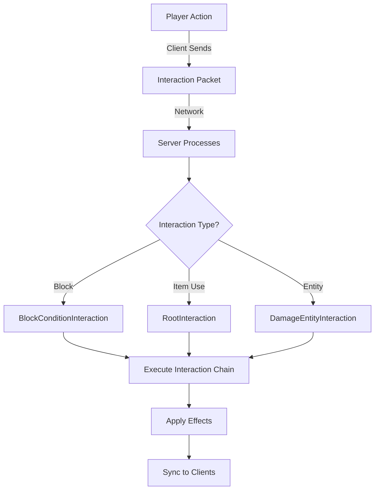
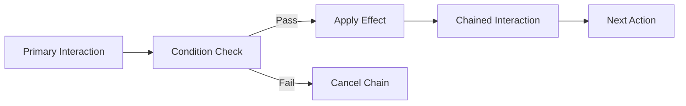
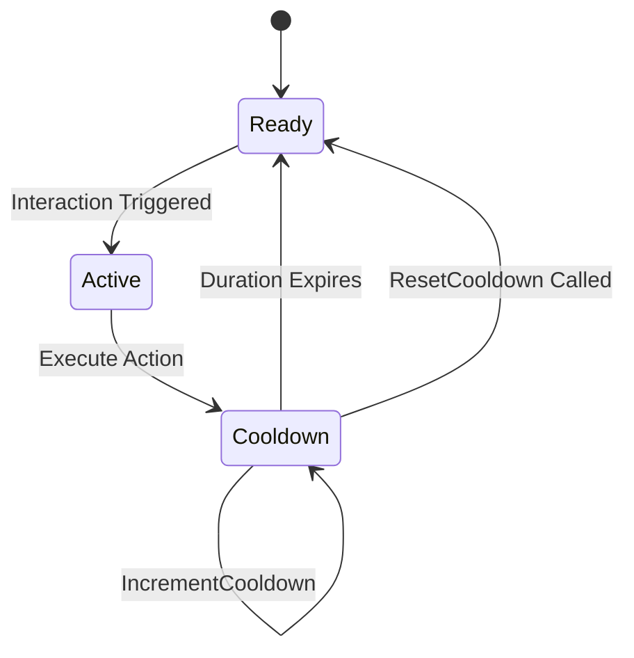
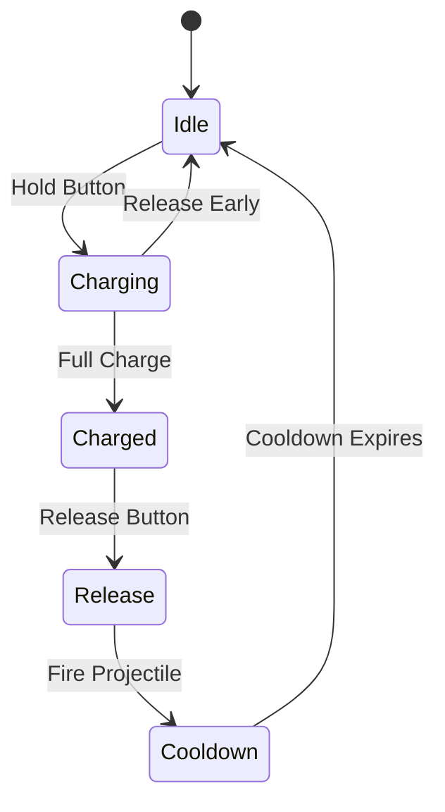

# Interaction System

The Interaction System in Hytale is a powerful, data-driven framework for defining player actions and their effects. Interactions are defined in JSON and handle everything from breaking blocks to using items and triggering abilities.

## Architecture Overview



## Core Concepts

### Interaction Types

The `InteractionType` enum defines **when** an interaction can be triggered:

| Type | Trigger | Example Use Case |
| :--- | :--- | :--- |
| **PRIMARY** | Left-click / Main action | Mining blocks, melee attacks |
| **SECONDARY** | Right-click / Secondary action | Place blocks, use items |
| **TERTIARY** | Special action button | Ability activation |
| **HOLD** | Continuous hold | Charging bows, eating food |
| **RELEASE** | Button release | Fire charged projectile |

### Interaction Chain

Interactions in Hytale use a **chain pattern** where multiple actions can be sequenced:



### Interaction Components

An interaction definition consists of:

1.  **Trigger**: InteractionType (PRIMARY, SECONDARY, etc.)
2.  **Conditions**: Requirements to execute (permissions, state, resources)
3.  **Effects**: What happens when executed
4.  **Chaining**: Follow-up interactions
5.  **Cooldowns**: Prevent spam
6.  **Sync**: Network synchronization settings

## Key Classes

### Interaction Base Classes

*   **`Interaction`**: Base class for all interactions
*   **`RootInteraction`**: Top-level interaction definition (attached to items/entities)
*   **`ChainedInteraction`**: Interaction triggered by another interaction
*   **`ConditionalInteraction`**: Interaction that checks conditions before executing

### Specific Interaction Types

From the 71 interaction-related classes found:

#### Block Interactions
*   **`BreakBlockInteraction`**: Mining/destroying blocks
*   **`PlaceBlockInteraction`**: Placing blocks in the world
*   **`ChangeBlockInteraction`**: Modifying existing blocks (doors, switches)
*   **`BlockConditionInteraction`**: Conditional logic based on block states

#### Combat Interactions
*   **`DamageEntityInteraction`**: Deal damage to entities
*   **`ProjectileInteraction`**: Fire projectiles
*   **`AngledDamage`**: Damage based on attack angle/momentum

#### Item Interactions
*   **`PickBlockInteraction`**: Pick block in creative mode
*   **`ModifyInventoryInteraction`**: Add/remove items from inventory
*   **`RefillContainerInteraction`**: Refill item containers

#### Effect Interactions
*   **`ApplyEffectInteraction`**: Apply status effects
*   **`ClearEntityEffectInteraction`**: Remove effects
*   **`ApplyForceInteraction`**: Apply physics forces (knockback)

#### State Management
*   **`ChangeStateInteraction`**: Modify entity/block states
*   **`ChangeStatInteraction`**: Modify statistics (health, mana)
*   **`ChangeActiveSlotInteraction`**: Switch hotbar slots

#### Advanced Patterns
*   **`ChargingInteraction`**: Hold-to-charge mechanics
*   **`ChainingInteraction`**: Sequential interaction chains
*   **`ParallelInteraction`**: Execute multiple interactions simultaneously
*   **`RepeatInteraction`**: Loop interactions
*   **`CancelChainInteraction`**: Stop interaction chain execution

## Interaction Configuration

### Root Interaction Settings

From `RootInteractionSettings` and `InteractionConfiguration`:

```json
{
  "type": "SECONDARY",
  "cooldown": {
    "duration": 1.5,
    "resetOnCancel": true
  },
  "conditions": [
    {
      "type": "MemoriesCondition",
      "requiredLevel": 5
    }
  ],
  "effects": [
    {
      "type": "ApplyEffect",
      "effect": "hytale:speed_boost",
      "duration": 10.0
    }
  ],
  "chainData": {
    "next": "hytale:follow_up_interaction"
  }
}
```

### Interaction Priorities

From `InteractionPriority`:

When multiple interactions are valid, priority determines execution order:

*   **HIGHEST**: Critical interactions (cancel actions)
*   **HIGH**: Important interactions (combat)
*   **NORMAL**: Standard interactions (block breaking)
*   **LOW**: Fallback interactions (default behavior)

## Interaction Conditions

Interactions can have multiple condition types:

### Resource Conditions
*   **`CooldownConditionInteraction`**: Check if cooldown expired
*   **`MemoriesConditionInteraction`**: Require progression level
*   **`EffectConditionInteraction`**: Require active status effect

### State Conditions
*   **`BlockConditionInteraction`**: Check block state/type
*   **`MovementConditionInteraction`**: Check player movement state
*   **Permissions**: Player has required permission nodes

### Environmental Conditions
*   **Target Type**: Entity, Block, or World
*   **Range**: Distance to target
*   **Line of Sight**: Clear path to target

## Interaction Effects

From `InteractionEffects`:

Effects are what actually happen when an interaction executes:

### Entity Effects
```java
// Apply a status effect to the player
{
  "type": "ApplyEffect",
  "target": "SELF",
  "effect": "hytale:regeneration",
  "duration": 30.0,
  "amplifier": 1
}
```

### World Effects
```java
// Change a block in the world
{
  "type": "ChangeBlock",
  "position": "TARGET",
  "newBlock": "hytale:torch_on",
  "playSound": true
}
```

### Inventory Effects
```java
// Consume an item from inventory
{
  "type": "ModifyInventory",
  "operation": "REMOVE",
  "item": "hytale:apple",
  "amount": 1,
  "slot": "ACTIVE"
}
```

## Interaction Targets

From `InteractionTarget`:

Interactions can target different entities:

*   **SELF**: The player performing the interaction
*   **TARGET**: The entity/block being interacted with
*   **WORLD**: Global effect (no specific target)
*   **OWNER**: For summoned entities (target the summoner)

## Cooldown System

From `InteractionCooldown` and `IncrementCooldownInteraction`:



### Cooldown Management

```java
// Example: Set a custom cooldown
{
  "type": "IncrementCooldown",
  "cooldownId": "my_plugin:special_ability",
  "duration": 5.0
}

// Reset a cooldown early
{
  "type": "ResetCooldown",
  "cooldownId": "my_plugin:special_ability"
}
```

## Interaction Chaining

From `InteractionChainData` and `ChainingInteraction`:

### Sequential Chains

Execute interactions one after another:

```json
{
  "interaction": "first_action",
  "chainData": {
    "next": "second_action",
    "delay": 0.5
  }
}
```

### Conditional Chains

From `ChainFlagInteraction`:

Branch based on success/failure:

```json
{
  "interaction": "try_action",
  "chainData": {
    "onSuccess": "success_action",
    "onFailure": "failure_action"
  }
}
```

### Parallel Execution

From `ParallelInteraction`:

Run multiple interactions simultaneously:

```json
{
  "type": "ParallelInteraction",
  "interactions": [
    "play_sound",
    "apply_effect",
    "spawn_particles"
  ]
}
```

## Camera Interactions

From `CameraInteraction` and `InteractionCamera`:

Interactions can control the camera:

*   **Shake**: Screen shake on impact
*   **Zoom**: Scope/aim mechanics
*   **FOV Change**: Dynamic field of view
*   **Lock Target**: Third-person camera tracking

```json
{
  "type": "CameraInteraction",
  "settings": {
    "shake": {
      "intensity": 0.5,
      "duration": 0.3
    }
  }
}
```

## Builder Tool Interactions

From `BuilderToolInteraction`:

Special interaction type for creative building tools:

*   **Selection**: Define regions
*   **Copy/Paste**: Schematic operations
*   **Fill**: Bulk block placement
*   **Extrude**: 3D shape generation

These are handled by dedicated builder packets (400+ packet IDs).

## Registering Custom Interactions (Plugin API)

### Listening to Interactions

```java
@Override
public void setup() {
    // Listen to any interaction event
    getEventRegistry().register(PlayerInteractEvent.class, event -> {
        Player player = event.getPlayer();
        InteractionType type = event.getInteractionType();
        
        if (type == InteractionType.SECONDARY) {
            // Player right-clicked
            ItemStack item = player.getActiveItem();
            
            if (item.getId().equals("my_mod:special_item")) {
                event.setCancelled(true); // Cancel default interaction
                
                // Custom logic here
                player.sendMessage("Special item activated!");
            }
        }
    });
}
```

### Defining Data-Driven Interactions

Interactions are primarily defined in **JSON** within item/entity definitions:

```json
{
  "id": "my_mod:magic_wand",
  "interactions": {
    "SECONDARY": {
      "type": "RootInteraction",
      "settings": {
        "cooldown": { "duration": 2.0 },
        "conditions": [
          {
            "type": "CooldownCondition",
            "cooldownId": "my_mod:magic_wand"
          }
        ],
        "effects": [
          {
            "type": "ProjectileInteraction",
            "projectile": "my_mod:magic_bolt",
            "speed": 30.0
          },
          {
            "type": "IncrementCooldown",
            "cooldownId": "my_mod:magic_wand",
            "duration": 2.0
          }
        ]
      }
    }
  }
}
```

## Interaction State Management

From `InteractionState` and `InteractionSyncData`:

The server tracks interaction states:

*   **Active**: Currently executing
*   **Cooldown**: Waiting for cooldown
*   **Charging**: Hold-to-charge in progress
*   **Cancelled**: Interrupted by player or condition

### State Synchronization

Interaction states must be synced to clients for UI feedback:

*   **Cooldown Timers**: Displayed on hotbar
*   **Charge Progress**: Shown on crosshair
*   **Active Effects**: Visual indicators

## AOE (Area of Effect) Interactions

From `AOECircleSelector` and `AOECylinderSelector`:

Interactions can affect multiple targets:

```json
{
  "type": "DamageEntity",
  "aoeType": "CIRCLE",
  "radius": 5.0,
  "maxTargets": 10,
  "filters": {
    "excludeSelf": true,
    "targetType": "ENEMY"
  }
}
```

## First Click vs Continuous

From `FirstClickInteraction`:

Distinguish between:

*   **First Click**: Trigger once on button press
*   **Continuous**: Trigger every tick while held

```java
{
  "type": "FirstClick",
  "initialDelay": 0.0,
  "repeatDelay": 0.5, // 0.5s between subsequent triggers
  "interaction": "attack_action"
}
```

## Network Synchronization

### Client → Server

When a player performs an interaction, the client sends:

*   **Interaction Type**: Which button was pressed
*   **Target**: Entity ID or block position (if applicable)
*   **Item**: Active item stack
*   **State**: Charging progress, hold duration

### Server → Client

The server broadcasts interaction results:

*   **Effects**: Visual/audio feedback
*   **State Changes**: Updated cooldowns, entity states
*   **Cancellations**: Rejected interactions (validation failed)

## Best Practices

### Performance

```java
// ❌ Bad: Heavy logic in interaction handler
event.getInteraction().execute(() -> {
    // Complex pathfinding, database queries, etc.
});

// ✅ Good: Offload to async task
event.getInteraction().execute(() -> {
    scheduler.runAsync(() -> {
        // Heavy computation
    });
});
```

### Validation

Always validate interactions server-side:

```java
public boolean validateInteraction(Player player, Interaction interaction) {
    // Check permissions
    if (!player.hasPermission(interaction.getRequiredPermission())) {
        return false;
    }
    
    // Check cooldowns
    if (player.isOnCooldown(interaction.getCooldownId())) {
        return false;
    }
    
    // Check resources (mana, stamina, etc.)
    if (!player.hasResources(interaction.getResourceCost())) {
        return false;
    }
    
    return true;
}
```

### Modularity

Break complex interactions into reusable chains:

```json
{
  "base_attack": {
    "effects": [
      { "type": "DamageEntity", "amount": 10 },
      { "type": "ApplyForce", "magnitude": 5.0 }
    ]
  },
  "critical_attack": {
    "chainData": {
      "bases": ["base_attack"],
      "additionalEffects": [
        { "type": "PlaySound", "sound": "critical_hit" }
      ]
    }
  }
}
```

## Integration with Other Systems

### Movement System

Interactions can modify movement:

```json
{
  "type": "ApplyForceInteraction",
  "direction": "FORWARD",
  "magnitude": 20.0,
  "movementType": "INSTANT"
}
```

### ECS Integration

Interactions trigger `EntityEventSystem` updates:

*   Health changes dispatch `EntityDamagedEvent`
*   State changes update ECS components
*   Effects are stored as ECS components

### Permissions

Interactions respect the permission system:

```java
interaction.setRequiredPermission("my_plugin.ability.fireball");
```

## Troubleshooting

### Interaction Not Triggering

*   **Check cooldowns**: Use debug logging to verify cooldown state
*   **Verify conditions**: Ensure all `ConditionInteraction` requirements are met
*   **Permission issues**: Confirm player has required permissions
*   **Network timing**: Client-server desync can cause missed interactions

### Interaction Spam

*   **Set appropriate cooldowns**: Prevent button mashing
*   **Use `FirstClickInteraction`**: Require button release
*   **Rate limiting**: Track interaction frequency per player

### Effects Not Syncing

*   **Check `InteractionSyncData`**: Verify sync settings
*   **Network packets**: Ensure effect packets are sent to relevant players
*   **Client prediction**: Some effects may need client-side prediction

## Advanced Patterns

### State Machine Interactions

Create complex state-based systems:



### Combo Systems

Chain interactions based on timing:

```java
// Detect rapid sequential interactions
if (timeSinceLastInteraction <  0.5) {
    comboCounter++;
    if (comboCounter == 3) {
        executeComboFinisher();
    }
}
```

### Context-Sensitive Interactions

Change interaction behavior based on context:

```java
if (player.isSneaking()) {
    // Execute alternate interaction
} else {
    // Execute default interaction
}
```
