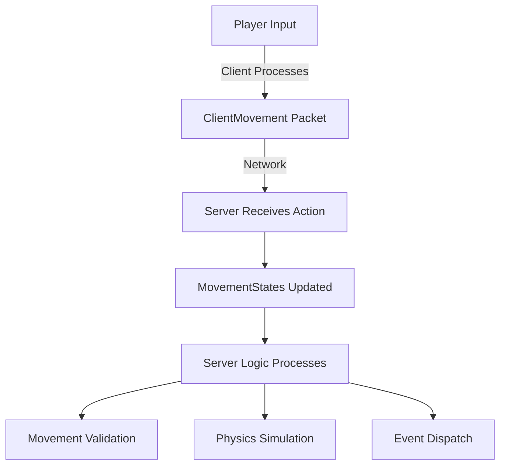
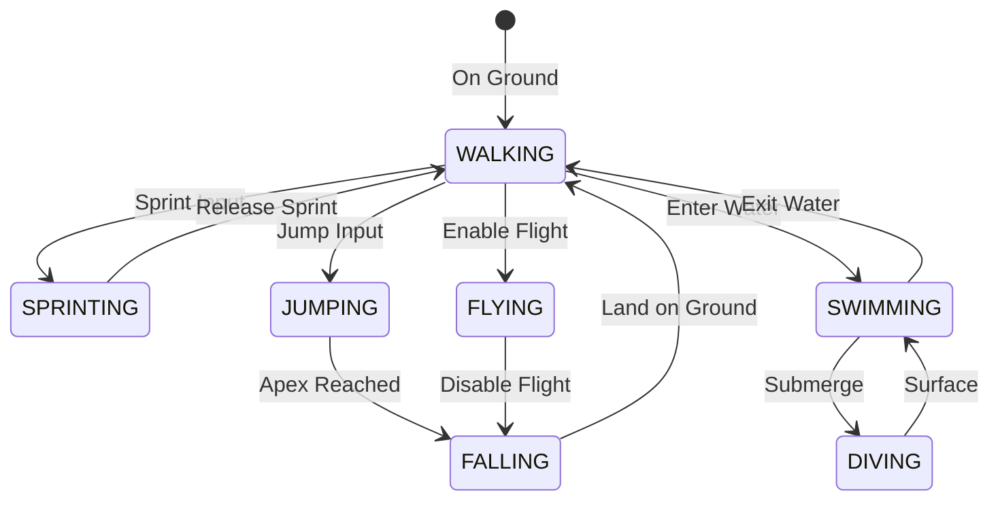

# Movement States System

The Movement States system in Hytale tracks and manages player movement on the server. Unlike keybinds (which are client-only), movement states represent the **actions** players are performing, not which keys they're pressing.

## Architecture Overview



## Core Classes

### Movement Packets

| Packet Class | Direction | Purpose |
| :--- | :--- | :--- |
| `ClientMovement` | Client → Server | Sends player movement input and position updates |
| `SetMovementStates` | Server → Client | Updates movement state flags for a player |
| `UpdateMovementSettings` | Server → Client | Modifies movement physics (speed, jump height, etc.) |

### Movement Data Structures

*   **`MovementStates`**: Bitfield tracking active movement states (sprinting, crouching, swimming, etc.)
*   **`SavedMovementStates`**: Persistent storage of movement states across sessions
*   **`MovementSettings`**: Physics parameters (walk speed, air control, jump force)
*   **`MovementDirection`**: Enum for directional movement (FORWARD, BACKWARD, LEFT, RIGHT, UP, DOWN)
*   **`MovementType`**: Movement mode classification (WALKING, SWIMMING, FLYING, CLIMBING)

## Movement State Flags

The `MovementStates` class uses bitflags to track multiple simultaneous movement actions:

```java
// Conceptual example based on common ECS patterns
public class MovementStates {
    private int stateFlags;
    
    public boolean isSprinting() { return (stateFlags & SPRINT_FLAG) != 0; }
    public boolean isCrouching() { return (stateFlags & CROUCH_FLAG) != 0; }
    public boolean isJumping() { return (stateFlags & JUMP_FLAG) != 0; }
    public boolean isSwimming() { return (stateFlags & SWIM_FLAG) != 0; }
    // ... other states
}
```

### Common Movement States

*   **Sprinting**: Player is moving faster than walk speed
*   **Crouching/Sneaking**: Player is in stealth mode (reduces hitbox, slower movement)
*   **Jumping**: Player initiated a jump
*   **Swimming**: Player is submerged in fluid
*   **Flying**: Player is in creative/spectator flight mode
*   **Climbing**: Player is ascending a climbable surface

## Reading Movement States (Plugin Code)

### Accessing Player Movement

```java
@Override
public void setup() {
    // Listen to player movement updates
    getEventRegistry().register(PlayerMoveEvent.class, event -> {
        Player player = event.getPlayer();
        
        // Access movement states (conceptual)
        MovementStates states = player.getMovementStates();
        
        if (states.isSprinting()) {
            // Player is sprinting
        }
        
        if (states.isCrouching()) {
            // Player is sneaking
        }
    });
}
```

### Modifying Movement Settings

```java
// Example: Slow down players in a specific zone
public void applySlowZone(Player player) {
    MovementSettings settings = player.getMovementSettings();
    
    // Create modified settings
    MovementSettings slowSettings = settings.withMultiplier(0.5f);
    
    // Apply to player
    player.setMovementSettings(slowSettings);
    
    // Server automatically syncs via UpdateMovementSettings packet
}
```

## Movement Physics

### Movement Settings Structure

`MovementSettings` controls the physical properties of player movement:

*   **`walkSpeed`**: Base movement speed while walking
*   **`sprintMultiplier`**: Speed multiplier when sprinting
*   **`crouchMultiplier`**: Speed multiplier when crouching
*   **`jumpForce`**: Vertical velocity applied on jump
*   **`airControl`**: How much control players have while airborne
*   **`friction`**: Deceleration when not providing input

### Block-Based Movement Modifiers

From `BlockMovementSettings` and `FluidFXMovementSettings`:

*   Blocks can override movement physics when players walk on them (ice, slime, etc.)
*   Fluids apply custom movement (water resistance, lava slowness)

## Movement Types

The `MovementType` enum categorizes how a player is currently moving:



## Movement Direction

`MovementDirection` represents the direction of player input:

*   **FORWARD** / **BACKWARD**: Z-axis movement
*   **LEFT** / **RIGHT**: X-axis strafing
*   **UP** / **DOWN**: Vertical movement (swimming, flying)

The server receives a **combination** of these directions in `ClientMovement` packets.

## Network Synchronization

### Client → Server (Movement Input)

The `ClientMovement` packet contains:
*   **Position**: Current player coordinates
*   **Velocity**: Current movement vector
*   **Rotation**: Pitch and yaw
*   **Input Flags**: Which movement directions are active
*   **State Flags**: Which movement states are active (sprinting, crouching, etc.)

### Server → Client (State Updates)

The server can force movement state changes via:
*   **`SetMovementStates`**: Override specific movement flags
*   **`UpdateMovementSettings`**: Change movement physics
*   **`ClientTeleport`**: Force position change

## Movement Force System

From `ApplyMovementType` and `MovementForceRotationType`:

The server can apply forces that affect movement:

*   **INSTANT**: Immediate velocity change (knockback)
*   **ACCELERATION**: Gradual force over time (wind, conveyor belts)
*   **RELATIVE**: Force applied relative to player facing
*   **ABSOLUTE**: Force applied in world space

```java
// Example: Apply knockback
public void applyKnockback(Player player, Vector3 direction, float force) {
    AppliedForce knockback = new AppliedForce()
        .withType(ApplyMovementType.INSTANT)
        .withDirection(direction)
        .withMagnitude(force);
    
    player.applyForce(knockback);
}
```

## Movement Effects

From `MovementEffects`:

Movement can trigger environmental effects:
*   **Footstep Sounds**: Based on block material and movement speed
*   **Particle Trails**: Sprinting on grass, swimming in water
*   **Screen Shake**: Landing from high falls
*   **FOV Changes**: Sprint FOV increase

## Best Practices

### Movement Validation

Always validate movement server-side to prevent cheating:

```java
public boolean isMovementValid(Player player, Vector3 newPosition) {
    Vector3 oldPosition = player.getPosition();
    float distance = oldPosition.distance(newPosition);
    float maxDistance = player.getMovementSettings().getMaxDistancePerTick();
    
    if (distance > maxDistance) {
        // Potential speed hack, reject movement
        player.teleport(oldPosition);
        return false;
    }
    
    return true;
}
```

### Performance Considerations

*   Movement packets are sent **every tick** (frequent)
*   Avoid heavy processing in movement event handlers
*   Use spatial partitioning for zone-based movement effects
*   Cache movement settings when possible

## Integration with Other Systems

### Interactions

Movement states affect interactions:
*   Crouching may prevent certain interactions
*   Sprinting may disable precision actions
*   Swimming changes interaction hitboxes

### Combat

Movement affects damage calculations:
*   Critical hits while falling (from `AngledDamage`)
*   Sprinting momentum for melee attacks
*   Movement penalties while charging abilities

### Entity Component System (ECS)

Movement is managed through ECS components:
*   Players are entities in the `EntityStore`
*   Movement components are updated each tick
*   Systems process movement based on component queries

## Troubleshooting

### Common Issues

**Players stuck in movement states:**
- Ensure state flags are cleared properly
- Check for network desync between client and server
- Verify physics simulation is running correctly

**Movement feels laggy:**
- Check network latency
- Verify tick rate is stable
- Ensure movement validation isn't too strict

**Players moving through blocks:**
- Verify collision detection is enabled
- Check movement validation distance thresholds
- Ensure chunk data is loaded before processing movement
