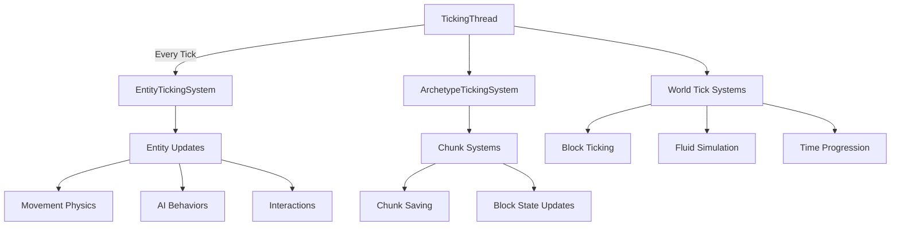
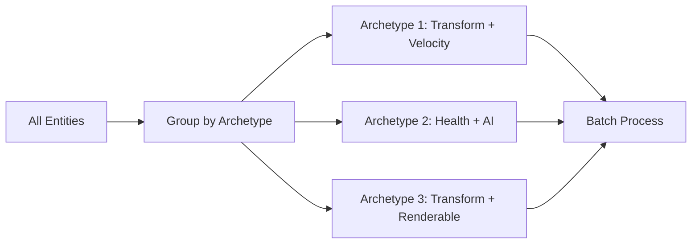
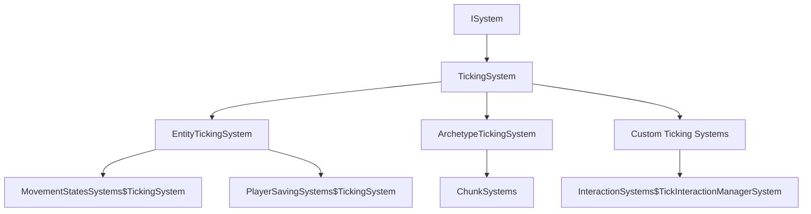
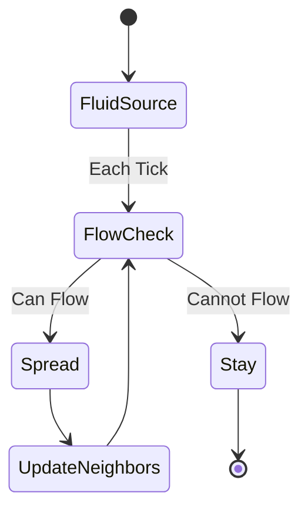
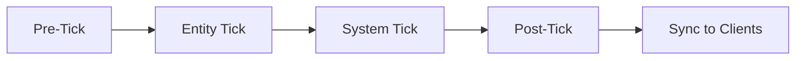

# Tick System

The Tick System is the core game loop in Hytale that drives all time-based updates. It orchestrates entity updates, physics simulation, block ticking, fluid flow, AI processing, and more through a sophisticated multi-threaded architecture integrated with the ECS (Entity Component System).

## Architecture Overview



## Core Tick Rate

The Hytale server operates at a **fixed tick rate**, typically **20 ticks per second** (TPS), meaning each tick is **50 milliseconds**.

> [!IMPORTANT]
> All time-based values in the server are tick-dependent. For example, a cooldown of "2.0 seconds" means 40 ticks (2.0 × 20 TPS).

## Key Classes

### TickingThread

`com.hypixel.hytale.server.core.util.thread.TickingThread`

The main game loop thread responsible for:
- Running at a fixed tick rate
- Executing ticking systems in order
- Measuring tick performance
- Handling tick lag (when a tick takes longer than 50ms)

```java
// Conceptual structure
public class TickingThread extends Thread {
    private final long tickIntervalNanos; // 50ms in nanoseconds
    private long currentTick = 0;
    
    @Override
    public void run() {
        while (running) {
            long tickStart = System.nanoTime();
            
            // Execute all ticking systems
            executeTick();
            
            // Sleep to maintain tick rate
            long tickDuration = System.nanoTime() - tickStart;
            long sleepTime = tickIntervalNanos - tickDuration;
            
            if (sleepTime > 0) {
                Thread.sleep(sleepTime / 1_000_000);
            } else {
                // Tick lag detected!
                logTickLag(tickDuration);
            }
            
            currentTick++;
        }
    }
}
```

### Tickable Interface

`com.hypixel.hytale.common.thread.ticking.Tickable`

The fundamental interface for any object that needs to update every tick:

```java
public interface Tickable {
    void tick();
}
```

## ECS Ticking Integration

The tick system is deeply integrated with the Entity Component System.

### TickingSystem

`com.hypixel.hytale.component.system.tick.TickingSystem`

ECS system interface for systems that execute every tick:

```java
public interface TickingSystem extends ISystem {
    void tick(Store<?> store);
}
```

Systems implementing `TickingSystem` are automatically invoked by the tick loop.

### EntityTickingSystem

`com.hypixel.hytale.component.system.tick.EntityTickingSystem`

Specialized ticking system for processing entities:

```java
// Processes all entities with specific components each tick
public abstract class EntityTickingSystem implements TickingSystem {
    @Override
    public void tick(Store<?> store) {
        // Query entities matching component requirements
        Query query = store.query()
            .with(RequiredComponent.class)
            .build();
        
        // Process each entity
        query.forEach(entityRef -> {
            tickEntity(entityRef);
        });
    }
    
    protected abstract void tickEntity(EntityRef entity);
}
```

### ArchetypeTickingSystem

`com.hypixel.hytale.component.system.tick.ArchetypeTickingSystem`

Optimized ticking system that processes entities grouped by archetype (component combination):



Benefits:
- **Cache Locality**: Components of the same archetype are stored contiguously
- **Parallel Processing**: Different archetypes can be processed on different threads
- **Reduced Overhead**: Avoids component lookups for each entity

### TickableSystem

`com.hypixel.hytale.component.system.tick.TickableSystem`

Marker interface for systems that should tick, used for system registration.

## Tick System Hierarchy



## Specialized Ticking Systems

### Block Ticking

From `BlockTickManager`, `BlockTickStrategy`, and `TickProcedure`:

Blocks can register tick procedures that execute at intervals:

```json
{
  "id": "hytale:wheat",
  "tickProcedure": {
    "strategy": "RANDOM",
    "interval": 20,
    "procedure": "grow_crop"
  }
}
```

**Tick Strategies:**
- **RANDOM**: Tick randomly selected blocks (like crop growth)
- **SEQUENTIAL**: Tick blocks in order (like redstone propagation)
- **SCHEDULED**: Tick at specific game times

**Block Tick Manager:**
- Maintains a queue of scheduled block ticks
- Processes ticks based on strategy
- Handles priority and ordering

```java
// Example: Registering a tickable block
public class GrowingCropBlockState extends TickableBlockState {
    @Override
    public void tick(World world, BlockPos pos) {
        // Growth logic
        if (random.nextFloat() < 0.1f) {
            grow();
        }
    }
    
    @Override
    public int getTickInterval() {
        return 20; // Tick every 20 ticks (1 second)
    }
}
```

### Fluid Ticking

From `FluidTicker`, `DefaultFluidTicker`, and `FiniteFluidTicker`:

Fluids have dedicated ticking systems for flow simulation:



**Fluid Tick Responsibilities:**
- **Flow Calculation**: Determine flow direction and speed
- **Block Interaction**: Interact with blocks (e.g., obsidian from lava + water)
- **Entity Effects**: Apply effects to entities in fluid (drowning, fire)
- **Source Management**: Track fluid sources vs. flowing fluid
- **Finite vs. Infinite**: Different tickers for different fluid types

### Entity Ticking

Multiple ticking systems handle different aspects of entities:

**Movement Ticking** (`MovementStatesSystems$TickingSystem`):
- Update velocity and position
- Apply physics (gravity, friction, collision)
- Process movement states (sprinting, crouching, swimming)

**AI Ticking** (`BlackboardSystems$TickingSystem`, `RoleSystems$BehaviourTickSystem`):
- Execute NPC behaviors
- Update blackboard (AI memory)
- Evaluate combat actions

**Interaction Ticking** (`InteractionSystems$TickInteractionManagerSystem`):
- Process held interactions (charging bows, eating food)
- Update cooldowns
- Sync interaction states

**Projectile Ticking** (`StandardPhysicsTickSystem`, `LegacyProjectileSystems$TickingSystem`):
- Update projectile trajectories
- Check for collisions
- Apply projectile effects on hit

### World Systems Ticking

**Time Progression** (`WorldTimeSystems$Ticking`):
- Advance world time (day/night cycle)
- Trigger time-based events (mob spawning, crop growth)

**Weather** (`WeatherSystem$TickingSystem`):
- Update weather states (rain, snow, storms)
- Apply weather effects (lightning strikes)

**Chunk Management** (`ChunkSystems`):
- Load/unload chunks based on player positions
- Save dirty chunks to disk
- Process chunk generation requests

**Spawn Management** (`SpawnBeaconSystems`):
- Tick spawn beacons for mob spawning
- Process spawn job queues
- Manage spawn cooldowns

## Tick Phases

Each tick is divided into phases:



### 1. Pre-Tick Phase

Systems implementing `NPCPreTickSystem` or similar:
- Prepare data for the tick
- Clear temporary buffers
- Pre-compute values

### 2. Entity Tick Phase

All `EntityTickingSystem` implementations execute:
- Movement physics
- AI behaviors
- Interactions
- Combat calculations

### 3. System Tick Phase

World-level systems execute:
- Block ticking
- Fluid simulation
- Chunk updates
- Time progression

### 4. Post-Tick Phase

Cleanup and synchronization:
- Apply command buffers (ECS structural changes)
- Save dirty data
- Prepare network packets

### 5. Network Sync

Send state updates to clients:
- Entity positions
- Block changes
- Inventory updates
- Event notifications

## Tick Lag and Performance

### Measuring Tick Performance

The server tracks tick duration:

```java
// Monitor tick times
long tickDuration = currentTickEndTime - currentTickStartTime;
if (tickDuration > 50_000_000) { // 50ms in nanos
    logger.warn("Tick lag: {}ms", tickDuration / 1_000_000);
}
```

### Tick Lag Indicators

When ticks take longer than 50ms:
- **TPS drops** below 20
- **Client lag** as updates are delayed
- **Time dilation** for tick-based timers

### Performance Optimization

**Commands for Debugging:**
- `ChunkForceTickCommand`: Force a chunk to tick for testing
- `SetTickingCommand`: Enable/disable ticking for a world/region
- `BlockSetTickingCommand`: Control block ticking

**Best Practices:**

```java
// ❌ Bad: Heavy computation in tick
public void tick() {
    for (int i = 0; i < 10000; i++) {
        expensiveCalculation();
    }
}

// ✅ Good: Spread work across multiple ticks
private int tickCounter = 0;
public void tick() {
    tickCounter++;
    if (tickCounter % 20 == 0) { // Once per second
        expensiveCalculation();
    }
}

// ✅ Better: Use async processing
public void tick() {
    if (shouldProcess()) {
        CompletableFuture.runAsync(() -> {
            expensiveCalculation();
        });
    }
}
```

## NonTicking Component

From `com.hypixel.hytale.component.NonTicking`:

Entities can be marked as non-ticking to exclude them from tick processing:

```java
// Mark an entity as non-ticking (static decoration, for example)
entity.addComponent(new NonTicking());
```

Benefits:
- Reduced CPU usage for inactive entities
- Improved cache utilization
- Better performance with many entities

## Delayed Execution

From `DelayedEntitySystem`:

Schedule actions to execute after a delay:

```java
// Execute after 100 ticks (5 seconds)
delayedSystem.schedule(entity, 100, () -> {
    // Action to perform
    entity.despawn();
});
```

## Paused Systems

From `RunWhenPausedSystem`:

Some systems continue to run even when the world is paused:
- UI updates
- Menu systems
- Admin commands

## Plugin Integration

### Creating a Ticking Plugin System

```java
public class MyTickingSystem implements TickingSystem {
    @Override
    public void tick(Store<?> store) {
        // Query entities
        Query query = store.query()
            .with(MyComponent.class)
            .without(NonTicking.class)
            .build();
        
        // Process each entity
        query.forEach(entityRef -> {
            MyComponent component = entityRef.get(MyComponent.class);
            component.counter++;
            
            if (component.counter >= 20) {
                // Do something every second
                processEntity(entityRef);
                component.counter = 0;
            }
        });
    }
    
    private void processEntity(EntityRef entity) {
        // Your logic here
    }
}

// Register in plugin setup()
@Override
public void setup() {
    // Systems are automatically ticked when registered with ECS
    getWorld().getEntityStore().registerSystem(new MyTickingSystem());
}
```

### Tick-Based Cooldowns

```java
public class CooldownManager {
    private final Map<UUID, Long> cooldowns = new HashMap<>();
    private long currentTick = 0;
    
    public void tick() {
        currentTick++;
        // Cooldowns are automatically expired by tick advancement
    }
    
    public void setCooldown(UUID playerId, int durationTicks) {
        cooldowns.put(playerId, currentTick + durationTicks);
    }
    
    public boolean isOnCooldown(UUID playerId) {
        Long expiryTick = cooldowns.get(playerId);
        return expiryTick != null && currentTick < expiryTick;
    }
    
    public int getRemainingTicks(UUID playerId) {
        Long expiryTick = cooldowns.get(playerId);
        if (expiryTick == null) return 0;
        return Math.max(0, (int)(expiryTick - currentTick));
    }
}
```

### Tick-Based Scheduling

```java
public class ScheduledTask {
    private final Runnable task;
    private final int executeTick;
    
    public ScheduledTask(Runnable task, int delayTicks, long currentTick) {
        this.task = task;
        this.executeTick = (int)(currentTick + delayTicks);
    }
    
    public boolean shouldExecute(long currentTick) {
        return currentTick >= executeTick;
    }
}

// Usage in a ticking system
private final Queue<ScheduledTask> scheduledTasks = new PriorityQueue<>();

public void scheduleTask(Runnable task, int delayTicks) {
    scheduledTasks.add(new ScheduledTask(task, delayTicks, currentTick));
}

@Override
public void tick() {
    currentTick++;
    
    while (!scheduledTasks.isEmpty() && 
           scheduledTasks.peek().shouldExecute(currentTick)) {
        ScheduledTask task = scheduledTasks.poll();
        task.execute();
    }
}
```

## Tick-Based Timers vs. Real-Time

> [!WARNING]
> **Tick-based time is NOT real-time!** If the server lags (TPS < 20), tick-based timers will also slow down. For real-time requirements (e.g., session timeouts), use `System.currentTimeMillis()`.

```java
// ❌ Tick-based (affected by lag)
if (entity.getTickAge() > 20 * 60) { // 60 "seconds" but might be longer
    despawn();
}

// ✅ Real-time (unaffected by lag)
if (System.currentTimeMillis() - entity.getSpawnTime() > 60_000) {
    despawn();
}
```

## Integration with Other Systems

### Physics Integration

Physics runs at tick rate:
- **Movement** updates position each tick
- **Collision detection** is per-tick
- **Gravity** applies acceleration each tick

```java
// Typical physics tick
public void tickPhysics(Entity entity) {
    // Apply gravity
    entity.velocity.y -= GRAVITY_PER_TICK;
    
    // Update position
    entity.position.add(entity.velocity);
    
    // Check collisions
    resolveCollisions(entity);
}
```

### Event System Integration

Many events are tick-triggered:
- `TickEvent`: Fired every tick
- `EntityTickEvent`: Fired when an entity ticks
- `BlockTickEvent`: Fired when a block ticks

```java
getEventRegistry().register(TickEvent.class, event -> {
    // Executes every tick (20 times/second)
    long currentTick = event.getCurrentTick();
});
```

### Interaction System Integration

From the Interaction System documentation:
- **Charging interactions** track ticks held
- **Cooldowns** are measured in ticks
- **Duration effects** count down each tick

## Debugging Tick Issues

### Common Problems

**Tick Lag:**
```java
// Symptoms: TPS < 20, stuttering gameplay
// Check server logs for tick duration warnings
// Use profilers to identify expensive tick operations
```

**Desync:**
```java
// Client and server tick out of sync
// Usually caused by network lag or packet loss
// Fixed by client-side prediction and server reconciliation
```

**Infinite Tick Loops:**
```java
// Avoid recursive ticking
// Example: Block A triggers Block B, which triggers Block A
// Use tick scheduling to break immediate recursion
```

### Tools and Commands

- `/tps` - Check current TPS
- `/tickinfo` - Detailed tick statistics
- `ChunkForceTickCommand` - Debug chunk ticking
- `SetTickingCommand` - Pause/resume ticking for debugging

## Best Practices

### 1. Minimize Per-Tick Work

```java
// Spread expensive operations
if (entity.getTickAge() % 100 == 0) {
    // Only every 5 seconds
    performPathfinding();
}
```

### 2. Use Spatial Partitioning

```java
// Don't check all entities
// Use spatial queries to limit searches
store.query()
    .withRadius(entity.getPosition(), 10.0)
    .with(Damageable.class)
    .forEach(this::processNearbyEntity);
```

### 3. Batch Operations

```java
// Collect changes, apply in batch
List<BlockChange> changes = new ArrayList<>();
// ... collect changes ...

// Apply all at once (more efficient)
world.applyBlockChanges(changes);
```

### 4. Profile and Optimize

```java
// Measure tick component costs
long start = System.nanoTime();
tickSystem();
long duration = System.nanoTime() - start;
if (duration > 5_000_000) { // 5ms
    logger.warn("Slow system: {}ms", duration / 1_000_000);
}
```

## Advanced Topics

### Tick Interpolation

Clients interpolate between tick updates for smooth rendering:
- Server sends entity positions at 20 TPS
- Client renders at 60+ FPS
- Positions are interpolated between server updates

### Tick Warping

Admin feature to speed up/slow down tick rate:
```java
// Run at 2x speed (40 TPS)
server.setTickMultiplier(2.0);
```

### Sub-Tick Precision

For very precise timing, some systems use sub-tick interpolation:
```java
// Position at time between ticks
Vector3 interpolatedPosition = 
    previous.lerp(current, partialTick);
```
